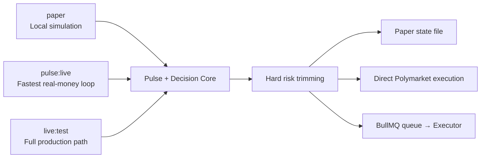

# Autonomous Poly Trading

中文版见 [README.md](README.md)。

Last updated: 2026-03-24

---

A cloud-native autonomous trading system for [Polymarket](https://polymarket.com). The goal is to build a trading Agent that **runs for real, is publicly observable, and enforces hard risk controls at the service layer**.

Core positioning:

- Single real-money wallet instance with a public read-only website
- Risk controls enforced as service-layer hard rules, not prompt suggestions
- Agent runs continuously in the cloud, not as ad-hoc local scripts
- Third parties can view real positions, trade history, NAV curves, and run reports on the web

## Table of Contents

- [Architecture Overview](#architecture-overview)
- [Monorepo Structure](#monorepo-structure)
- [Three Execution Paths](#three-execution-paths)
- [Decision Engine](#decision-engine)
- [Risk Control System](#risk-control-system)
- [Quick Start](#quick-start)
- [Environment Variables](#environment-variables)
- [Command Reference](#command-reference)
- [Deployment](#deployment)
- [External Repository Dependencies](#external-repository-dependencies)
- [Run Archives](#run-archives)
- [Current Status](#current-status)
- [Documentation Index](#documentation-index)

---

## Architecture Overview

The system has four layers; data flows top to bottom:

```
┌─────────────────────────────────────────────────────────────┐
│  Layer 1 · Research / Pulse                                 │
│  Fetches Polymarket market listings, generates Pulse pool   │
│  Output → runtime-artifacts/reports/pulse/...               │
└───────────────────────────┬─────────────────────────────────┘
                            ▼
┌─────────────────────────────────────────────────────────────┐
│  Layer 2 · Decision / Runtime                               │
│  Orchestrator turns Pulse + portfolio context → decisions   │
│  Primary: pulse-direct │ Legacy: provider-runtime           │
└───────────────────────────┬─────────────────────────────────┘
                            ▼
┌─────────────────────────────────────────────────────────────┐
│  Layer 3 · Execution / Risk                                 │
│  Service-layer hard risk trimming → executor order / sync   │
│  FOK market orders · per-trade ≤5% · total exposure ≤50%   │
└───────────────────────────┬─────────────────────────────────┘
                            ▼
┌─────────────────────────────────────────────────────────────┐
│  Layer 4 · State / Archive / UI                             │
│  DB / local state / runtime-artifacts archive / apps/web    │
└─────────────────────────────────────────────────────────────┘
```

See [Illustration/onboarding-architecture.en.md](Illustration/onboarding-architecture.en.md) for the Mermaid diagram and detailed module connections.

## Monorepo Structure

This is a `pnpm` monorepo (`pnpm@10.28.1`, Node ≥ 20) with no root-level `src/`. Source code is distributed across these packages:

```
autonomous-poly-trading/
├── apps/
│   └── web/                          # Next.js 16: public dashboard + admin console
├── services/
│   ├── orchestrator/                 # Scheduling, Pulse, decision runtime, risk, reports
│   ├── executor/                     # Polymarket CLOB, order execution, sync, queue worker
│   └── rough-loop/                   # Standalone code-task loop (not on the trading path)
├── packages/
│   ├── contracts/                    # Zod schemas: TradeDecisionSet and shared contracts
│   ├── db/                           # Drizzle schema, migrations, queries, local-state
│   └── terminal-ui/                  # Terminal colored output, error summaries, tables
├── scripts/                          # Workspace-level entry points: daily-pulse, live-test
├── vendor/                           # External repo lock manifest (manifest.json)
├── deploy/hostinger/                 # VPS deployment scripts and env templates
├── Illustration/                     # Architecture diagrams, flow charts (bilingual)
├── Plan/                             # Phase planning documents
├── Wasted/                           # Archived legacy handoffs, exploration notes, history
├── E2E Test Driven Development/      # Playwright + Vitest E2E suite
├── runtime-artifacts/                # Run artifacts (.gitignored, only .gitkeep tracked)
├── docker-compose.yml                # Local Postgres 17 + Redis 8
├── docker-compose.hostinger.yml      # Production-oriented container orchestration
└── package.json                      # Root scripts + workspace dependencies
```

### Module Responsibilities

| Module | Purpose | Key Entry |
| --- | --- | --- |
| `apps/web` | Public pages (overview/positions/trades/runs/reports/backtests) + admin ops | `app/page.tsx` |
| `services/orchestrator` | Pulse generation → decision runtime → risk trimming → report artifacts | `src/jobs/daily-pulse-core.ts` |
| `services/executor` | Polymarket CLOB orders, position sync, stop-loss, flatten | `src/workers/queue-worker.ts`, `src/lib/polymarket.ts` |
| `packages/contracts` | `TradeDecisionSet`, `actionSchema`, queue/job names | `src/index.ts` |
| `packages/db` | DB schema + queries; file-backed local state for paper mode | `src/queries.ts`, `src/local-state.ts` |
| `packages/terminal-ui` | Terminal UI utilities | `src/index.ts` |
| `scripts/` | CLI entry points that wire up different run modes | `daily-pulse.ts`, `pulse-live.ts`, `live-test.ts` |
| `services/rough-loop` | Automated code-task loop (not involved in trading) | `src/cli.ts` |

## Three Execution Paths



| Path | Command | Dependencies | Best For |
| --- | --- | --- | --- |
| **paper** | `pnpm trial:recommend` / `trial:approve` | Local file | Simulation & manual confirmation |
| **pulse:live** | `pnpm pulse:live` | Wallet + Polymarket | Fastest real-money loop, onboarding default |
| **live:test** | `pnpm live:test` | Wallet + DB + Redis + Queue | Full production path |

Note: `pnpm daily:pulse` is not a fourth path — it's a convenience wrapper around `pulse:live` that defaults to `.env.pizza`, `LANTERN_EXECUTION_MODE=live`, and `pulse-direct`.

### Execution Flow

**All live paths must go through Preflight** — it's a mandatory phase, not a standalone mode.

**pulse:live**:

```
Preflight → Fetch remote positions/collateral → Pulse generation → Decision runtime → Risk guards + token cap → Direct execution → Summary archive
```

**live:test**:

```
Preflight (+DB/Redis/Queue) → Pulse generation → Agent cycle (decisions + persistence) → Queue dispatch → Executor worker → Sync → Summary archive
```

**paper**:

```
Load portfolio context → Pulse generation → Decision runtime → shared buildExecutionPlan (same risk + exchange-threshold rules as pulse:live) → awaiting-approval → trial:approve → Paper state update
```

## Decision Engine

Two decision strategies controlled by `AGENT_DECISION_STRATEGY`:

### pulse-direct (Current Default)

```
Pulse markdown → Regex/table parsing → PulseEntryPlan
                                              ↓
Current positions → reviewCurrentPositions → hold/reduce/close
                                              ↓
                      composePulseDirectDecisions → TradeDecisionSet
```

No external LLM process needed. Extracts entry candidates directly from structured Pulse sections and combines with position review.

### provider-runtime (Legacy)

Spawns an external process (Codex / OpenClaw CLI), passes Pulse + portfolio context to the LLM, and parses stdout into a `TradeDecisionSet`. Still functional but no longer the default.

## Risk Control System

Risk controls are service-layer hard rules. Regardless of which provider or strategy is used upstream, everything entering the orchestrator / executor pipeline is constrained.

### System Level

| Rule | Threshold | Effect |
| --- | --- | --- |
| Portfolio drawdown halt | NAV drawdown from HWM ≥ **20%** | Enter `halted`, block all new opens |
| Recovery | Admin `resume` only | Fail-closed by design |

### Position Level

| Rule | Threshold |
| --- | --- |
| Per-position stop-loss | Unrealized loss ≥ **30%** |
| Stop-loss priority | Higher than regular strategy actions |

### Execution Level

| Rule | Default |
| --- | --- |
| Order type | **FOK** market orders |
| Per-trade cap | **5%** of bankroll |
| Max total exposure | **50%** of bankroll |
| Max event exposure | **30%** of bankroll |
| Max concurrent positions | **10** |
| Min effective notional | Below threshold → discard |

### Pulse Level

- Must come from real `fetch_markets.py` — no mock fallback
- Stale pulse, insufficient candidates, or missing `clobTokenIds` → risk state, no new `open` allowed
- `open` actions' `token_id` must originate from Pulse candidates

Full rules: [risk-controls.en.md](risk-controls.en.md).

## Quick Start

### Minimal Build (Verify Compilation)

```bash
git clone https://github.com/Alchemist-X/autonomous-poly-trading.git
cd autonomous-poly-trading
pnpm install
pnpm build
```

No Docker, Codex CLI, or wallet credentials required — just verifying TS / Next.js compilation.

### Run Pulse and Recommendation

```bash
cp .env.example .env
pnpm vendor:sync
# Fill in CODEX_COMMAND / wallet credentials
pnpm daily:pulse              # Convenience entry point
# or
pnpm pulse:live -- --recommend-only   # View recommendations without trading
```

### Full Local Stack (Stateful)

```bash
cp .env.example .env
pnpm install
pnpm vendor:sync
docker compose up -d postgres redis
pnpm db:migrate
pnpm db:seed
pnpm dev
```

Default ports: Web `3000` / Orchestrator `4001` / Executor `4002`

### Paper Mode

```bash
LANTERN_EXECUTION_MODE=paper pnpm trial:recommend
LANTERN_EXECUTION_MODE=paper pnpm trial:approve -- --latest
```

State defaults to `runtime-artifacts/local/paper-state.json`.
`trial:recommend` now uses the same pre-execution rule set as `pulse:live`: it reads the order book, applies the same risk clipping, minimum trade size, and Polymarket executable minimum checks. The difference is only the landing step: paper stops at `awaiting-approval` instead of sending a live order immediately.

## Environment Variables

Full template: [.env.example](.env.example)

Organized in four groups:

| Group | Key Variables | Purpose |
| --- | --- | --- |
| **Shared** | `LANTERN_EXECUTION_MODE` `DATABASE_URL` `REDIS_URL` `LANTERN_LOCAL_STATE_FILE` | Execution mode (paper/live), infra connections |
| **Web** | `ADMIN_PASSWORD` `ORCHESTRATOR_INTERNAL_TOKEN` | Admin authentication |
| **Executor** | `PRIVATE_KEY` `FUNDER_ADDRESS` `SIGNATURE_TYPE` `CHAIN_ID` | Polymarket wallet & chain config |
| **Orchestrator** | `AGENT_RUNTIME_PROVIDER` `AGENT_DECISION_STRATEGY` `PULSE_*` `CODEX_*` | Provider selection, Pulse fetching, risk params |

If Polymarket credentials live in an adjacent repo, set `ENV_FILE=../pm-PlaceOrder/.env.aizen`. For real-money testing, use a dedicated `.env.live-test`.

## Command Reference

### Build & Validation

```bash
pnpm build              # Full workspace build
pnpm typecheck          # Full type check
pnpm test               # Vitest unit tests
```

### Database

```bash
pnpm db:generate        # Generate migration
pnpm db:migrate         # Run migrations
pnpm db:seed            # Seed data
```

### Trading Paths

```bash
# Paper
LANTERN_EXECUTION_MODE=paper pnpm trial:recommend
LANTERN_EXECUTION_MODE=paper pnpm trial:approve -- --latest

# Pulse Live
ENV_FILE=.env.live-test pnpm pulse:live
ENV_FILE=.env.live-test pnpm pulse:live -- --recommend-only
ENV_FILE=.env.live-test pnpm pulse:live -- --json

# Live Stateful
ENV_FILE=.env.live-test pnpm live:test

# Daily Pulse (convenience wrapper for pulse:live)
pnpm daily:pulse
```

### Executor Ops

```bash
pnpm --filter @lantern/executor ops:check
pnpm --filter @lantern/executor ops:check -- --slug <market-slug>
pnpm --filter @lantern/executor ops:trade -- --slug <market-slug> --max-usd 1
```

### E2E

```bash
pnpm e2e:install-browsers
pnpm e2e:local-lite
LANTERN_E2E_REMOTE=1 pnpm e2e:remote-real
```

### Rough Loop

```bash
pnpm rough-loop:doctor
pnpm rough-loop:once
pnpm rough-loop:start
```

### Vendor

```bash
pnpm vendor:sync        # Sync external repos to vendor/repos/
```

## Deployment

| Component | Recommended Deployment |
| --- | --- |
| `apps/web` | Vercel (read-only Postgres credentials) |
| `services/orchestrator` | Single cloud VM |
| `services/executor` | Same VM |
| Postgres 17 | Managed database |
| Redis 8 | Co-located or managed |

Hostinger VPS deployment: see [Illustration/hostinger-vps-deploy-runbook.en.md](Illustration/hostinger-vps-deploy-runbook.en.md), with `docker-compose.hostinger.yml` and `deploy/hostinger/stack.env.example`.

Admin operations go through protected internal API to orchestrator; ports 4001/4002/5432/6379 are not publicly exposed.

## External Repository Dependencies

`vendor/manifest.json` pins these external repos to specific commits:

| Repository | Purpose |
| --- | --- |
| `polymarket-trading-TUI` | Trading terminal and CLOB wiring reference |
| `polymarket-market-pulse` | Pulse research input |
| `alert-stop-loss-pm` | Stop-loss logic reference |
| `all-polymarket-skill` | Backtesting, monitor, resolution skills reference |
| `pm-PlaceOrder` | Order placement reference and local credential source |

Run `pnpm vendor:sync` to sync them into `vendor/repos/`. Plain `pnpm build` doesn't need vendor, but pulse / trial / live paths require it.

## Run Archives

All run artifacts go to `runtime-artifacts/` (gitignored), rooted at `ARTIFACT_STORAGE_ROOT`.

| Path | Contents |
| --- | --- |
| `reports/pulse/YYYY/MM/DD/` | Pulse markdown + JSON (`pulse-<timestamp>-<runtime>-<mode>-<runId>`) |
| `reports/review\|monitor\|rebalance/` | Portfolio reports |
| `reports/runtime-log/` | Decision runtime explanatory logs |
| `pulse-live/<timestamp>-<runId>/` | Pulse Live runs: preflight, recommendation, execution-summary, run-summary |
| `live-test/<timestamp>-<runId>/` | Stateful runs: same + error.json on failure |
| `checkpoints/trial-recommend/` | Paper recommendation resume checkpoints |
| `local/paper-state.json` | Default paper state file |
| `rough-loop/` | Rough Loop task artifacts |

Failure archives (per AGENTS convention) go to `run-error/` with stage, core context, root-cause summary, and next-step command.

## Current Status

As of 2026-03-24.

### Subsystem Completion

| Subsystem | Status | Notes |
| --- | --- | --- |
| Monorepo build | ✅ Done | `build` / `typecheck` / `test` workspace support |
| Web dashboard + admin | ✅ Done | Overview, positions, trades, runs, reports, backtests, admin |
| Shared contracts / DB / Terminal UI | ✅ Done | Schema, queries, local state, terminal rendering |
| Paper test bench | ✅ Done | Recommend → manual approve → file-backed state |
| `pulse:live` | ✅ Done and actively running | 37 pulse-live run archives (03/16–03/24) |
| `live:test` stateful | ⚠️ Implemented but blocked | Code works, local machine lacks DB/Redis so preflight always fails |
| Real Pulse fetching | ✅ Done | ~50+ Pulse reports produced (03/14–03/23) |
| `pulse-direct` decision engine | ✅ Live | Default since 03/20, replacing provider-runtime |
| Bilingual run summaries | ✅ Done | Chinese + English per live run |
| Review / Monitor / Rebalance reports | ✅ Done | Auto-generated with daily pulse / live runs since 03/20 |
| Hard risk controls | ✅ Done | `applyTradeGuards` + halt + stop-loss |
| Polymarket proxy wallet compat | ✅ Done | `FUNDER_ADDRESS` / `SIGNATURE_TYPE` |
| Resolution tracking | ✅ Implemented | Independent periodic capability with real artifacts |
| Backtest | ⚠️ Lightweight | Connected to artifact layer, not production-grade |
| OpenClaw provider | 🔲 Reserved | Interface exists, not current default |
| Rough Loop | ✅ Standalone | 5 automated code-task runs on 03/17 |
| VPS deployment | ✅ Documented | Hostinger runbook + Docker compose |
| CI/CD | 🔲 Pending | No GitHub Actions yet |

### Actual Run Data

**Active wallet: Pizza** (`0x6664***614e`), collateral ~$96.95 USDC.

**Current on-chain positions (pizza wallet, last snapshot 2026-03-23)**:

| Market | Direction | Size | Avg Cost | Current Price | Unrealized P&L |
| --- | --- | --- | --- | --- | --- |
| Bitcoin dip to 65k in March 2026 | BUY No | 1.34 | $0.746 | $0.742 | -0.5% |
| Gavin Newsom 2028 Dem nomination | BUY No | 1.32 | $0.758 | $0.758 | 0% |
| Gavin Newsom 2028 presidential election | BUY No | 1.21 | $0.825 | $0.835 | +1.2% |

**Paper state**: $200 bankroll / $176 cash / 2 simulated positions (Vance + Avalanche), last run 03/16.

### Run Timeline

| Date | Event |
| --- | --- |
| **03/14** | First Pulse reports generated (codex provider-runtime), 15 pulses; first real $1 test trade matched |
| **03/16** | Paper mode full loop completed (recommend → approve → state update); first pulse-live runs; Pizza wallet connectivity verified |
| **03/17** | Multiple pulse-live runs; no1 wallet snapshot showed 12 real positions / $128 total equity; Rough Loop completed 5 code-task runs |
| **03/18** | Portfolio review report generated independently for first time; pulse-live preflight pending |
| **03/20** | **pulse-direct engine goes live**, replacing provider-runtime as default; review / monitor / rebalance reports auto-generated per run; one crude oil order rejected by Polymarket ($0.34) |
| **03/23** | Heavy run day — 8 pulse-live runs (pizza wallet); live:test attempt failed (DATABASE_URL not configured); VPS SSH connectivity postmortem; last complete run artifact at 15:05 UTC |
| **03/24** | One pending preflight exists, full run not completed |

### Known Issues and Blockers

| Issue | Impact | Status |
| --- | --- | --- |
| No local Postgres / Redis | `live:test` stateful path always fails at preflight | Needs Docker or remote DB |
| Pulse provider timeout | Some runs degrade to deterministic fallback, lower entry candidate quality | Intermittent |
| Min trade threshold | Risk guard $10 minimum blocks small pulse-live open candidates | By design; pulse-live path lowered to $0.01 |
| Order rejected by Polymarket | One crude oil $0.34 order rejected | Archived, no impact on subsequent runs |

### Known Limitations

- `live:test` path cannot be verified on local machine, needs remote infrastructure
- Full production deployment not yet condensed into a single deploy handbook
- `provider-runtime` will continue to be de-emphasized as a legacy path
- Backtest remains lightweight
- No CI/CD pipeline
- No automated reconciliation or alert notifications

## Dependency Matrix

| Dependency | Required | Purpose |
| --- | --- | --- |
| Node.js ≥ 20 | ✅ Yes | Monorepo build and runtime |
| pnpm 10.x | ✅ Yes | Workspace package management (currently `10.28.1`) |
| TypeScript 5.9.x | Built-in | TS compilation |
| Docker / docker compose | Optional | Local Postgres + Redis |
| Postgres 17 | Optional | Required for `live:test` |
| Redis 8 | Optional | Required for `live:test` |
| Codex CLI | Runtime | `provider-runtime` / Pulse generation |
| Polymarket wallet credentials | Live paths | Real-money orders |

### Core Runtime Dependencies

| Package | Main Dependencies |
| --- | --- |
| `apps/web` | Next.js 16, React 19 |
| `services/orchestrator` | Fastify 5, BullMQ 5, ioredis 5, drizzle-orm, node-cron |
| `services/executor` | @polymarket/clob-client 5, ethers 5, Fastify 5, BullMQ 5 |
| `packages/db` | postgres, drizzle-orm, drizzle-kit |
| `packages/contracts` | zod 4 |

## Documentation Index

### Root

| Document | Contents |
| --- | --- |
| [risk-controls.en.md](risk-controls.en.md) | Full risk control rules |
| [.env.example](.env.example) | Environment variable template |
| [progress.en.md](progress.en.md) | Implementation progress |
| [todo-loop.en.md](todo-loop.en.md) | Upcoming high-priority items |
| [rough-loop.md](rough-loop.md) | Rough Loop main documentation |
| [AGENTS.en.md](AGENTS.en.md) | Project collaboration conventions |

Note: historical handoff docs, exploration notes, and one-off progress records now live under [Wasted/README.en.md](Wasted/README.en.md) instead of the repo root.

### Illustration/

| Document | Contents |
| --- | --- |
| [onboarding-architecture.en.md](Illustration/onboarding-architecture.en.md) | Onboarding architecture + module map + state source guide |
| [trading-modes-flowchart.en.md](Illustration/trading-modes-flowchart.en.md) | Trading mode flowchart |
| [portfolio-ops-report-design.en.md](Illustration/portfolio-ops-report-design.en.md) | Monitor / Review / Rebalance report design |
| [hostinger-vps-deploy-runbook.en.md](Illustration/hostinger-vps-deploy-runbook.en.md) | Hostinger VPS deployment runbook |
| [repo-slimming-plan.en.md](Illustration/repo-slimming-plan.en.md) | Module keep/merge/drop checklist |

### Plan/

| Document | Contents |
| --- | --- |
| [2026-03-17-rough-loop-8h-run-plan.en.md](Plan/2026-03-17-rough-loop-8h-run-plan.en.md) | Rough Loop 8-hour continuous run plan |
| [2026-03-17-position-review-module-plan.en.md](Plan/2026-03-17-position-review-module-plan.en.md) | Position Review module design |

### Wasted/

| Document | Contents |
| --- | --- |
| [README.en.md](Wasted/README.en.md) | Guide to archived legacy docs and historical leftovers |

## Onboarding Path for New Contributors

If this is your first time working with this repository:

1. **Read this document** — understand the four layers and three execution paths
2. **Check [.env.example](.env.example)** — understand run modes and dependencies
3. **Check [risk-controls.en.md](risk-controls.en.md)** — understand hard risk rules
4. **Check [Illustration/onboarding-architecture.en.md](Illustration/onboarding-architecture.en.md)** — understand module boundaries, state sources, and the default primary path
5. **Check [Illustration/trading-modes-flowchart.en.md](Illustration/trading-modes-flowchart.en.md)** — understand execution path branching
6. **Run `pnpm build`** — verify the build works
7. **Run `pnpm daily:pulse` or `pnpm pulse:live -- --recommend-only`** — see a full decision output

If you just need to "get the project building", step 6 is enough.
